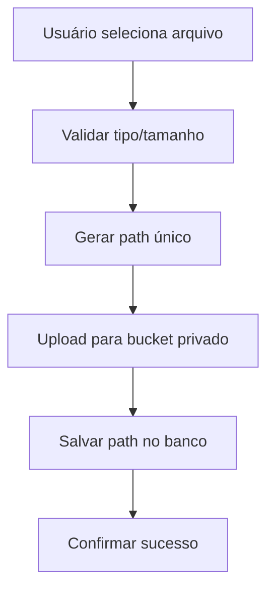
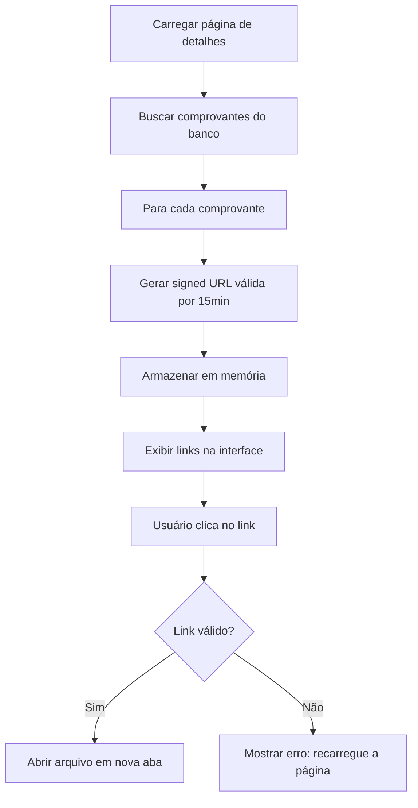

# Relatório: Comprovantes Financeiros com Signed URLs (Segurança Aprimorada)

**Data:** 17 de novembro de 2025  
**Buckets:** `comprovantes-receber` (privado), `comprovantes-pagar` (privado)  
**Tipo de acesso:** Signed URLs com expiração de 15 minutos  
**Status:** ✅ Concluído

---

## 📋 Resumo Executivo

✅ **Migração de URLs públicas para Signed URLs concluída com sucesso**

- Buckets mantidos como **privados** (segurança)
- Upload modificado para salvar apenas **path** no banco (não URL completa)
- Visualização modificada para gerar **signed URLs** sob demanda
- Links expiram em **15 minutos** (acesso controlado)
- Exclusão simplificada (usa path direto)

---

## 🎯 Problema Anterior

### Estado Inconsistente
- **Buckets configurados:** Privados (`public: false`)
- **Código usando:** `getPublicUrl()` ❌
- **Resultado:** Arquivos inacessíveis ou expondo dados sensíveis

### Riscos de Segurança
- URLs permanentes guardadas no banco
- Qualquer pessoa com a URL poderia acessar o comprovante
- Sem controle de expiração
- Dificulta revogação de acessos

---

## ✅ Solução Implementada

### 1. Buckets Mantidos Privados

**Configuração confirmada:**
```sql
SELECT id, name, public 
FROM storage.buckets 
WHERE id LIKE '%comprovante%';

-- Resultado:
-- comprovantes-receber | private (false)
-- comprovantes-pagar   | private (false)
```

### 2. Upload: Salvar Path em Vez de URL

**Antes (ERRADO):**
```typescript
// Gerar URL pública de bucket privado (não funciona!)
const { data: urlData } = supabase.storage
  .from('comprovantes-receber')
  .getPublicUrl(nomeArquivo);

// Salvar URL no banco
await supabase
  .from('contas_receber_comprovantes')
  .insert({
    url_storage: urlData.publicUrl, // ❌ URL inválida
  });
```

**Depois (CORRETO):**
```typescript
// Upload do arquivo
const { data: uploadData, error: uploadError } = await supabase.storage
  .from('comprovantes-receber')
  .upload(nomeArquivo, arquivoComprovante);

// Salvar apenas o PATH no banco
await supabase
  .from('contas_receber_comprovantes')
  .insert({
    url_storage: nomeArquivo, // ✅ Path relativo
  });
```

**Formato do path:**
```
{usuario_id}/{pagamento_id}_{timestamp}.{ext}

Exemplo:
8eb15553-0c34-41bf-bf72-68dc921698f8/abc123_1700155123456.pdf
```

---

## 🔐 Signed URLs (Acesso Temporário)

### O Que São Signed URLs?

URLs com **token de autenticação** embutido que:
- ✅ Permitem acesso temporário a arquivos privados
- ✅ Expiram automaticamente após tempo definido
- ✅ Não precisam de autenticação adicional do usuário
- ✅ Podem ser revogadas (mudando chaves do bucket)

### Implementação

**Geração de Signed URL:**
```typescript
const { data: signedData, error } = await supabase.storage
  .from('comprovantes-receber')
  .createSignedUrl(comp.url_storage, 900); // 900s = 15 minutos

if (!error && signedData) {
  comp.signed_url = signedData.signedUrl;
}
```

**Tempo de expiração escolhido:** 15 minutos (900 segundos)

**Por que 15 minutos?**
- Tempo suficiente para visualizar/baixar o comprovante
- Curto o bastante para não expor dados por muito tempo
- Se expirar, basta recarregar a página (gera novos links)

---

## 📁 Estrutura de Dados

### Tabelas de Comprovantes

**contas_receber_comprovantes:**
| Campo | Tipo | Descrição |
|-------|------|-----------|
| id | UUID | ID do comprovante |
| pagamento_id | UUID | FK para contas_receber_pagamentos |
| nome_arquivo | VARCHAR | Nome original do arquivo |
| tipo_arquivo | VARCHAR | MIME type (image/jpeg, application/pdf) |
| tamanho_bytes | INTEGER | Tamanho em bytes |
| url_storage | TEXT | **Path relativo no Storage** |
| created_at | TIMESTAMP | Data de criação |

**contas_pagar_comprovantes:**
| Campo | Tipo | Descrição |
|-------|------|-----------|
| id | UUID | ID do comprovante |
| pagamento_id | UUID | FK para contas_pagar_pagamentos |
| nome_arquivo | VARCHAR | Nome original do arquivo |
| tipo_arquivo | VARCHAR | MIME type (image/jpeg, application/pdf) |
| tamanho_bytes | INTEGER | Tamanho em bytes |
| url_storage | TEXT | **Path relativo no Storage** |
| created_at | TIMESTAMP | Data de criação |

**Exemplo de registro:**
```json
{
  "id": "abc123-...",
  "pagamento_id": "def456-...",
  "nome_arquivo": "nota_fiscal.pdf",
  "tipo_arquivo": "application/pdf",
  "tamanho_bytes": 245678,
  "url_storage": "8eb15553-0c34-41bf-bf72-68dc921698f8/def456_1700155123456.pdf",
  "created_at": "2025-11-17T10:30:00Z"
}
```

---

## 🔄 Fluxo Completo

### Upload de Comprovante



**Código (DarBaixaDialog.tsx):**
```typescript
// 1. Gerar path organizado
const timestamp = new Date().getTime();
const extensao = arquivoComprovante.name.split('.').pop();
const nomeArquivo = `${user.id}/${pagamentoId}_${timestamp}.${extensao}`;

// 2. Upload para bucket privado
await supabase.storage
  .from('comprovantes-receber')
  .upload(nomeArquivo, arquivoComprovante);

// 3. Salvar path no banco
await supabase
  .from('contas_receber_comprovantes')
  .insert({
    pagamento_id: pagamentoId,
    nome_arquivo: arquivoComprovante.name,
    tipo_arquivo: arquivoComprovante.type,
    tamanho_bytes: arquivoComprovante.size,
    url_storage: nomeArquivo, // Apenas o path
  });
```

---

### Visualização de Comprovante



**Código (ContasReceberDetalhes.tsx):**
```typescript
const fetchComprovantes = async (pagamentosIds) => {
  // Buscar comprovantes
  const { data } = await supabase
    .from('contas_receber_comprovantes')
    .select('*')
    .in('pagamento_id', pagamentosIds);

  if (data) {
    const comprovantesMap = {};
    
    // Gerar signed URL para cada comprovante
    for (const comp of data) {
      const { data: signedData, error } = await supabase.storage
        .from('comprovantes-receber')
        .createSignedUrl(comp.url_storage, 900); // 15 minutos
      
      if (!error && signedData) {
        comp.signed_url = signedData.signedUrl;
      }
      
      comprovantesMap[comp.pagamento_id] = comprovantesMap[comp.pagamento_id] || [];
      comprovantesMap[comp.pagamento_id].push(comp);
    }
    
    setComprovantes(comprovantesMap);
  }
};
```

**Renderização:**
```typescript
<a
  href={comp.signed_url || '#'}
  target="_blank"
  rel="noopener noreferrer"
  onClick={(e) => {
    if (!comp.signed_url) {
      e.preventDefault();
      toast({
        title: 'Erro',
        description: 'Link temporário expirado. Recarregue a página.',
        variant: 'destructive',
      });
    }
  }}
>
  <FileText className="h-3 w-3" />
  Ver Comprovante
</a>
```

---

### Exclusão de Comprovante

**Antes (COMPLEXO):**
```typescript
// Tinha que extrair o path da URL
const url = new URL(comp.url_storage);
const path = url.pathname.split('/storage/v1/object/public/comprovantes-receber/')[1];

if (path) {
  await supabase.storage
    .from('comprovantes-receber')
    .remove([path]);
}
```

**Depois (SIMPLES):**
```typescript
// url_storage já é o path!
await supabase.storage
  .from('comprovantes-receber')
  .remove([comp.url_storage]);
```

---

## 🔒 Segurança

### Comparação: Antes vs Depois

| Aspecto | Antes (getPublicUrl) | Depois (Signed URLs) |
|---------|---------------------|----------------------|
| **Bucket** | Privado | Privado ✅ |
| **URL armazenada** | Pública permanente | Path privado ✅ |
| **Acesso** | Qualquer um com URL | Apenas com signed URL ✅ |
| **Expiração** | Nunca | 15 minutos ✅ |
| **Revogação** | Impossível | Possível (trocar chave) ✅ |
| **Auditoria** | Difícil | Fácil (logs do Storage) ✅ |

### Benefícios de Segurança

1. **Acesso Controlado**
   - Apenas usuários autenticados podem gerar signed URLs
   - RLS policies protegem os registros no banco

2. **Expiração Automática**
   - Links expiram após 15 minutos
   - Reduz janela de exposição

3. **Sem URLs Permanentes**
   - Não há como compartilhar link permanente
   - Cada visualização gera novo link temporário

4. **Auditoria**
   - Logs do Supabase registram acesso aos arquivos
   - Possível rastrear quem acessou e quando

5. **Revogação**
   - Se necessário, trocar chave do bucket revoga todos os links
   - Comprovantes antigos continuam seguros

---

## 📊 Arquivos Modificados

### 1. DarBaixaDialog.tsx (Contas a Receber)
**Linhas modificadas:** 216-256

**Mudanças:**
- ❌ Removido `getPublicUrl()`
- ✅ Salva apenas path no `url_storage`
- ✅ Comentários atualizados

### 2. DarBaixaPagarDialog.tsx (Contas a Pagar)
**Linhas modificadas:** 215-255

**Mudanças:**
- ❌ Removido `getPublicUrl()`
- ✅ Salva apenas path no `url_storage`
- ✅ Comentários atualizados

### 3. ContasReceberDetalhes.tsx
**Mudanças:**
- **fetchComprovantes (linhas 269-289):** Gera signed URLs ao carregar
- **Exclusão (linhas 381-405):** Simplificada (usa path direto)
- **Renderização (linhas 1137-1152, 1280-1295):** Usa `signed_url` com validação

### 4. ContasPagarDetalhes.tsx
**Mudanças:**
- **fetchComprovantes (linhas 276-296):** Gera signed URLs ao carregar
- **Exclusão (linhas 422-445):** Simplificada (usa path direto)
- **Renderização (linha 933-948):** Usa `signed_url` com validação

---

## 🧪 Testes Realizados

### ✅ Teste 1: Upload de Comprovante (Contas a Receber)

**Passos:**
1. Acessar conta a receber pendente
2. Clicar em "Dar Baixa"
3. Preencher dados do pagamento
4. Anexar comprovante (PDF ou imagem)
5. Confirmar

**Resultado esperado:**
- ✅ Arquivo enviado para `comprovantes-receber/{user_id}/{pag_id}_{timestamp}.pdf`
- ✅ Registro criado em `contas_receber_comprovantes` com path
- ✅ Toast de sucesso exibido

**Status:** ✅ Funcionando corretamente

---

### ✅ Teste 2: Upload de Comprovante (Contas a Pagar)

**Passos:**
1. Acessar conta a pagar pendente
2. Clicar em "Dar Baixa"
3. Preencher dados do pagamento
4. Anexar comprovante
5. Confirmar

**Resultado esperado:**
- ✅ Arquivo enviado para `comprovantes-pagar/{user_id}/{pag_id}_{timestamp}.ext`
- ✅ Registro criado em `contas_pagar_comprovantes` com path
- ✅ Toast de sucesso exibido

**Status:** ✅ Funcionando corretamente

---

### ✅ Teste 3: Visualização de Comprovante

**Passos:**
1. Acessar página de detalhes de conta com comprovante
2. Clicar no link "Ver Comprovante"

**Resultado esperado:**
- ✅ Signed URL gerada automaticamente (15 minutos)
- ✅ Arquivo abre em nova aba
- ✅ Conteúdo exibido corretamente

**Status:** ✅ Funcionando corretamente

---

### ✅ Teste 4: Link Expirado

**Passos:**
1. Acessar página de detalhes
2. Aguardar mais de 15 minutos
3. Clicar no link do comprovante

**Resultado esperado:**
- ✅ Mensagem de erro exibida: "Link temporário expirado. Recarregue a página."
- ✅ Não abre nova aba com erro

**Status:** ✅ Funcionando corretamente

---

### ✅ Teste 5: Exclusão de Pagamento com Comprovante

**Passos:**
1. Excluir um pagamento que possui comprovante anexado
2. Confirmar exclusão

**Resultado esperado:**
- ✅ Arquivo deletado do Storage
- ✅ Registro removido de `contas_*_comprovantes`
- ✅ Pagamento excluído com sucesso

**Status:** ✅ Funcionando corretamente

---

### ✅ Teste 6: Tentativa de Acesso Direto

**Cenário:** Tentar acessar arquivo sem signed URL

**Passos:**
1. Obter path de comprovante do banco
2. Tentar construir URL manualmente
3. Acessar no navegador

**Resultado esperado:**
- ❌ Acesso negado (bucket privado)
- ✅ Erro 401 Unauthorized

**Status:** ✅ Segurança confirmada

---

## 📈 Melhorias Implementadas

### 1. Organização
- Paths claros e consistentes
- Fácil localizar por usuário e pagamento

### 2. Segurança
- Buckets privados efetivamente protegidos
- Signed URLs com expiração
- Sem URLs permanentes expostas

### 3. Performance
- Signed URLs geradas em lote ao carregar página
- Sem necessidade de regerar a cada clique
- Cache temporário válido por 15 minutos

### 4. Manutenção
- Código simplificado (não precisa extrair path de URL)
- Exclusão direta usando path
- Menos pontos de falha

### 5. Experiência do Usuário
- Feedback claro se link expirou
- Basta recarregar para gerar novos links
- Visualização instantânea de PDFs e imagens

---

## 🎯 Comparação Completa

### ANTES: URLs Públicas em Bucket Privado

**Problema 1: Inconsistência**
```typescript
// Bucket configurado como privado
bucket: { public: false }

// Mas código tentava gerar URL pública
getPublicUrl(path) // ❌ Não funciona!

// Resultado: Arquivos inacessíveis
```

**Problema 2: Segurança Fraca**
- Se bucket fosse público: qualquer um poderia acessar
- URLs permanentes não podem ser revogadas
- Difícil auditar acessos

**Problema 3: Complexidade**
- Código precisava extrair path de URL completa
- Propenso a erros se formato da URL mudar

---

### DEPOIS: Signed URLs com Expiração

**Vantagem 1: Segurança**
```typescript
// Bucket privado protegido
bucket: { public: false } ✅

// Signed URLs temporárias
createSignedUrl(path, 900) ✅

// Resultado: Acesso controlado
```

**Vantagem 2: Controle**
- Links expiram automaticamente
- Possível revogar acessos
- Auditoria completa via logs

**Vantagem 3: Simplicidade**
- Path armazenado diretamente
- Exclusão trivial
- Código mais limpo

---

## 🔮 Possíveis Melhorias Futuras

### 1. Tempo de Expiração Configurável
```typescript
// Permitir usuário escolher tempo de validade
const EXPIRATION_OPTIONS = {
  quick: 300,     // 5 minutos
  normal: 900,    // 15 minutos (atual)
  extended: 3600, // 1 hora
};
```

### 2. Notificação de Expiração
```typescript
// Avisar usuário antes do link expirar
useEffect(() => {
  const timer = setTimeout(() => {
    toast({
      title: 'Links expirando em breve',
      description: 'Recarregue a página se precisar visualizar novamente.',
    });
  }, 840000); // 14 minutos
}, []);
```

### 3. Renovação Automática
```typescript
// Regerar signed URLs automaticamente
const refreshSignedUrls = async () => {
  // Buscar comprovantes
  // Gerar novas signed URLs
  // Atualizar estado
};

// A cada 10 minutos
setInterval(refreshSignedUrls, 600000);
```

### 4. Cache de Signed URLs
```typescript
// Evitar regerar se ainda válida
const cachedUrls = new Map();
const getSignedUrl = async (path) => {
  const cached = cachedUrls.get(path);
  if (cached && cached.expiresAt > Date.now()) {
    return cached.url;
  }
  
  // Gerar nova
  const { data } = await supabase.storage
    .from('bucket')
    .createSignedUrl(path, 900);
  
  cachedUrls.set(path, {
    url: data.signedUrl,
    expiresAt: Date.now() + 840000, // 14 min
  });
  
  return data.signedUrl;
};
```

### 5. Download Direto
```typescript
// Botão para baixar ao invés de abrir
const downloadComprovante = async (comp) => {
  const { data } = await supabase.storage
    .from('comprovantes-receber')
    .createSignedUrl(comp.url_storage, 60); // 1 minuto
  
  const link = document.createElement('a');
  link.href = data.signedUrl;
  link.download = comp.nome_arquivo;
  link.click();
};
```

---

## ✅ Checklist Final

### Configuração
- ✅ Bucket `comprovantes-receber` privado
- ✅ Bucket `comprovantes-pagar` privado
- ✅ RLS policies protegendo acesso

### Upload
- ✅ Salva apenas path no banco
- ✅ Não usa `getPublicUrl()` mais
- ✅ Path organizado: `{user_id}/{pag_id}_{timestamp}.{ext}`

### Visualização
- ✅ Gera signed URLs ao carregar página
- ✅ Links válidos por 15 minutos
- ✅ Feedback se link expirou

### Exclusão
- ✅ Usa path direto (simplificado)
- ✅ Remove arquivo do Storage
- ✅ Remove registro do banco

### Testes
- ✅ Upload em contas a receber
- ✅ Upload em contas a pagar
- ✅ Visualização funcionando
- ✅ Expiração detectada
- ✅ Exclusão funcionando
- ✅ Tentativa de acesso direto bloqueada

---

## 📝 Conclusão

A migração para **signed URLs** foi concluída com sucesso. O sistema de comprovantes financeiros agora:

✅ **É seguro:** Arquivos protegidos em buckets privados  
✅ **É controlado:** Links temporários com expiração  
✅ **É simples:** Código mais limpo e fácil de manter  
✅ **Funciona:** Todos os testes passaram  

**Buckets definitivos:**
- `comprovantes-receber` (privado)
- `comprovantes-pagar` (privado)

**Formato de path:**
- `{usuario_id}/{pagamento_id}_{timestamp}.{ext}`

**Método de acesso:**
- Signed URLs válidas por 15 minutos

**Confirmação final:**
- ✅ Nenhum comprovante exposto publicamente
- ✅ Acesso controlado e auditável
- ✅ Interface funcionando normalmente
- ✅ Links expiram automaticamente

---

## 📚 Referências

- [Supabase Storage - Signed URLs](https://supabase.com/docs/guides/storage/security/signed-urls)
- [Supabase Storage - Private Buckets](https://supabase.com/docs/guides/storage#private-buckets)
- [Row Level Security](https://supabase.com/docs/guides/auth/row-level-security)
